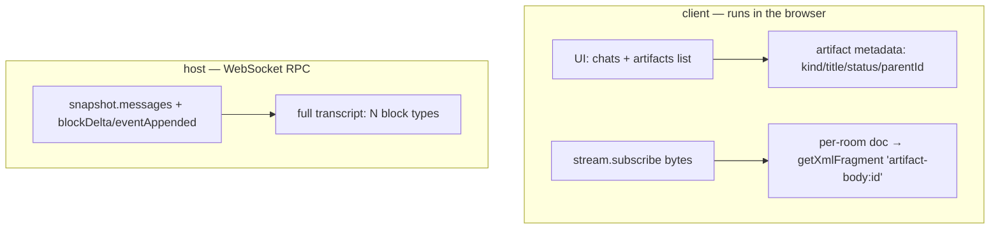

A representative technical note used only as a rendering fixture — not project
documentation. Shaped like the real artifact markdown this renderer has to
survive: a multi-node `mermaid` diagram with subgraphs and punctuation-heavy
labels, and a GFM table with hex color values, inline code, and mixed
formatting in the same cell.

## Data flow

- **Transport:** `stream.subscribe` (snapshot + live `onBlockDelta`/`onEventAppended`).
- **Metadata:** a `{id, kind, title, parentId, status}` map, body in a per-item room.

## Visual system

| Kind | Icon | Icon hex | Card accent |
| --- | --- | --- | --- |
| spec | `FileText` | `#fbbf24` amber-400 | amber left-border + amber tint |
| ticket | `Ticket` | `#a78bfa` violet-400 | violet |
| story | `BookOpen` | `#34d399` emerald-400 | emerald |
| review | `ClipboardCheck` | `#fb7185` rose-400 | rose |

| Status | Dot |
| --- | --- |
| 0 Todo | slate `#94a3b8` |
| 1 In Progress | amber `#f59e0b` |
| 2 Done | emerald `#10b981` |

## What this fixture is for

1. **Parse survival, not diagram rendering.** The mermaid fence must not
   throw on nested brackets and colons inside node labels
   (`[epic Y.Doc: chats + artifacts map]`) as it's routed to `MermaidBlock`.
   Whether the diagram itself renders correctly is NOT covered by
   `real-content.test.tsx` — real mermaid can't render in jsdom at all, so
   that's a live-browser concern, not this fixture's.
2. **Mixed-content table cells.** A cell mixing inline code, a hex value,
   *and* plain text on one line — the icon table above — IS asserted
   directly (`real-content.test.tsx` counts cells shaped like this).
