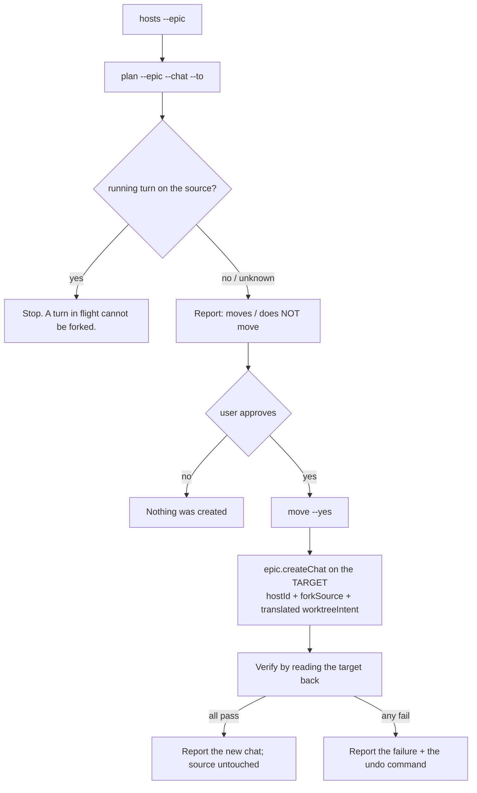

# Traycer Move Chat

A chat is bound to its host **for life** — `chat.hostId` is stamped at creation and never changes. So "moving" a chat is really **cloning it forward**: a sibling chat on the target host carrying the transcript, leaving the original exactly where it was.

That is not a workaround. It is what the product already does when you switch a chat tab's host, and what `epic.createChat`'s `forkSource` was built for. This skill combines the two halves — target host *and* history — which the desktop UI never does together.

The one thing the user must understand before approving: **the model does not resume its session.** It re-reads the transcript on the new host. Continuity of *record*, not continuity of *context*.

## What is actually where

Do not re-derive this; it is measured.

| Thing | Replicated to every host | Host-local |
| --- | --- | --- |
| Chat transcript, title, run settings, events | ✅ the epic's Yjs room | |
| Epic artifacts, workspace/repo tables | ✅ | |
| `worktreeBinding` (which folder a chat runs in) | | ✅ SQLite, per host |
| Harness session (`activeSessionChain`) | | ✅ |
| Agent processes, terminals, TUI agents | | ✅ |
| Provider credentials / profiles | | ✅ |

Two consequences that drive the whole flow:

1. **The target host already holds the history.** It forks from its own replicated copy. Nothing crosses between hosts, so **a chat can be moved off a machine that is shut down** — measured, with the source neither configured nor contacted, and with the source host bound to loopback only so the target had no route to it either. No bridge or tunnel is involved; the move is one call to the target.
2. **The target's view of a foreign chat's workspace is a fabrication.** Ask a host about a chat bound elsewhere and it will happily report a `worktreeBinding` — its own epic-inherited guess, at its own paths. Read workspaces from the **source** host, or from the replicated session snapshot, never from the target.

## Flow



## Gather

```
node scripts/chat-transfer/move-chat.mjs hosts --epic <epicId>
node scripts/chat-transfer/move-chat.mjs plan --epic <epicId> --chat <chatId> --to <alias>
```

`hosts` proves each host's id from a binding row it owns — `host.status` does not report one, and a wrong id would bind the new chat to a phantom host. If a host shows `hostId unknown`, it owns nothing in that epic yet; set `hostId` in the config file the command names.

`plan` writes nothing. It reads the chat from the **target** (proving the target holds the history it is about to fork) and the workspaces from the **source**.

If the user has not named the chat by id, get it from the desktop URL or ask. Do not guess.

## Report

Present `plan`'s output, then add the judgement it cannot make:

- **Lead with what is lost, not what is carried.** The carried part is unsurprising; the losses are what the user needs to decide on. `plan` names the per-chat ones — messages after the fork boundary, pending approvals and questions, the source worktree and its branch.
- **Name the workspace translation explicitly**, both sides. `C:\repo\x → /srv/traycer/repo/Owner/x` is the step most likely to be wrong, and it is the one the user can check at a glance.
- **If the source host was not read**, say so plainly. The plan will show `source host not read` — that means a turn could be running there unseen, and the workspaces came from the harness session snapshot rather than the real binding.
- **If nothing translated**, the chat lands folderless. Offer `--workspace <path>` rather than letting it land empty by default. `plan` refuses a `--workspace` that does not exist on the target — including a POSIX path an MSYS shell rewrote into `C:/Program Files/Git/srv/...`, which is easy to produce from Git Bash and looks correct in every other check.
- **A `worktree`-mode source is the common trap.** The source runs in a worktree on a branch; the target gets the plain checkout unless the branch is pushed and `--branch <name>` is passed. Uncommitted work in that worktree does not exist on the target at all. Say this in the user's own terms — "the changes you have not committed stay on the old machine".

Then ask. The move creates a chat in a shared epic; it is visible to the user immediately.

## Act

```
node scripts/chat-transfer/move-chat.mjs move --epic <epicId> --chat <chatId> --to <alias> --yes
```

Options worth reaching for: `--title` (default is the source's title, so two identically-named chats appear), `--branch <name>` to recreate a worktree, `--workspace <path>` to place it by hand, `--no-workspace` to land folderless.

The command re-runs the plan, creates, then **verifies by reading the target back** — that the chat exists there, is bound to that host, carries the expected message count, records its source in a `chat.forked` event, owns a real binding row on that machine pointing at a folder that actually exists, and that **the source is still intact**. Report the PASS/FAIL lines as they came; do not restate them as a claim of your own.

On failure, nothing needs undoing for safety — the source was never written to — but the partial clone is noise:

```
node scripts/chat-transfer/move-chat.mjs undo --epic <epicId> --chat <newChatId> --to <alias>
```

`undo` refuses any chat without a `chat.forked` event, so it cannot delete a chat this tool did not create.

## Rules

- **Never delete or modify the source chat.** Not after a successful move, not on request as part of a move. If the user wants it gone, that is a separate, explicitly-confirmed action after they have seen the clone working.
- **Never move a chat with a turn in flight.** `plan` blocks on a non-idle source. If the source host could not be read, the run status is unknown — say so and let the user decide, do not assume idle.
- **Never present the move as lossless.** The harness session always resets. A user who thinks the model "carries on where it left off" will be confused by the first reply.
- **Never read a foreign chat's workspace from the target.** It answers confidently and wrongly.
- **Never invent a target path.** If the repo is not checked out on the target, say so and offer `--workspace`; a plausible-looking path that does not exist produces a chat that cannot run.
- Two chats now hold the same history. Suggest a `--title` that says which host it lives on, or renaming the original.
